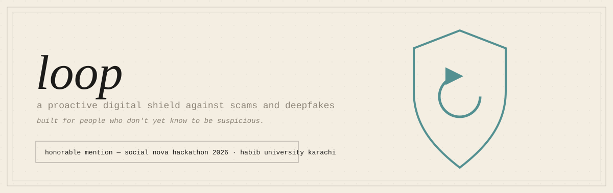
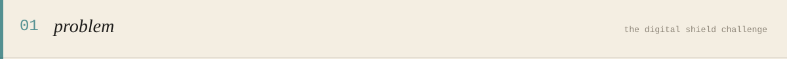
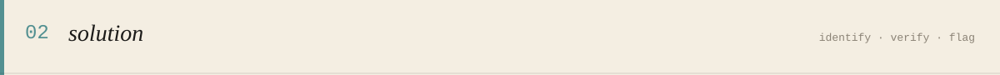
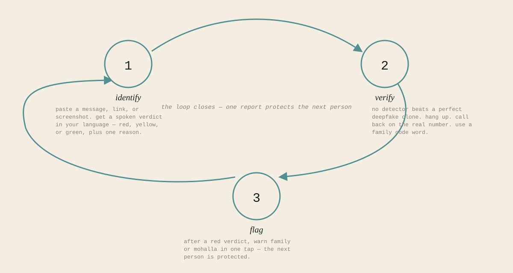
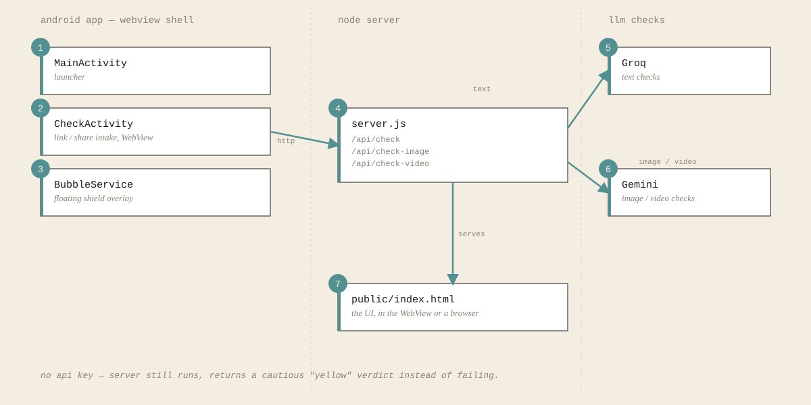
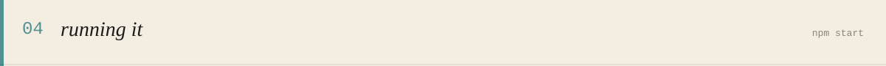
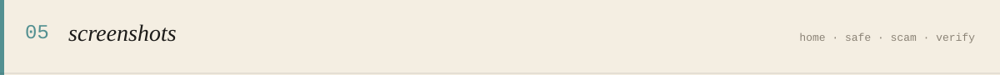
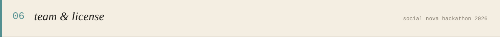

<p align="center"></p>

Loop is a **proactive** shield, not a reactive scanner. It's built for people who don't yet know to be suspicious — not for people who already do.

<p align="center"></p>

The Social Nova hackathon challenge, "The Digital Shield," asked: how do you help non-technical, low-literacy users identify, verify, and flag AI-generated deepfakes and scams *before* they get fooled? Existing tools are text-heavy, English-first, and reactive — they only help someone who already suspects something is wrong. Full challenge handout: [`docs/problem-statement/`](docs/problem-statement).

<p align="center"></p>

<p align="center"></p>

For deepfake voice and video "emergencies" there's no reliable detector, so Loop forces the one defence that beats even a perfect clone instead of trying to out-detect it.

Android is the core of the design, not an afterthought. Loop registers as the default handler for `http`/`https` links, so a tapped link gets checked before it opens. Android's share sheet gives a share-to-Loop flow with no onboarding needed.

Full product reasoning, trust principles, and stated limitations: [`docs/pitch/loop-brief.md`](docs/pitch/loop-brief.md) (original concept) and [`docs/pitch/PITCH_BRIEF.md`](docs/pitch/PITCH_BRIEF.md) (as built).

<p align="center"></p>

<p align="center"></p>

- `server.js` — plain Node `http` server, no framework. Routes `/api/check*`, serves `public/`.
- `verdict.js`, `image-verdict.js`, `video-verdict.js` — build the LLM prompt/response per input type. Each fails safe to a cautious yellow verdict if the API call fails or a key is missing.
- `load-env.js` — hand-rolled `.env` loader, no dependency.
- `public/index.html` — the UI. Loads inside the app's WebView, also works directly in a browser.
- `android/` — the Android shell: link handler, share target, floating bubble, all pointing at the Node server.

<p align="center"></p>

```bash
npm start        # http://localhost:3000
npm test         # scenario checks in test_check.js
```

Requires a `.env` in the project root (not committed):

```
GROQ_API_KEY=...
GEMINI_API_KEY=...
```

No keys, no crash — the server still runs and returns a generic cautious verdict instead of failing.

To run the Android shell: open `android/` in Android Studio, point `CheckActivity.SERVER_URL` at the machine running the Node server, run on a device on the same network.

<p align="center"></p>

| Home | Safe (green) | Scam (red) |
|---|---|---|
|  |  |  |
| Paste a message/link, or try a live demo | No suspicious content — nothing to do | Fake-OTP-helpline scam caught, with one plain reason |

| Proactive link interception | Verify (voice/video emergency) |
|---|---|
|  |  |
| A tapped scam link is caught *before* it opens | Forces the one defence that beats even a perfect clone: hang up, call back, family code word |

<p align="center"></p>

Built solo by Arham for Social Nova Hackathon 2026 at Habib University, Karachi.

[MIT](LICENSE)

— Arham.
