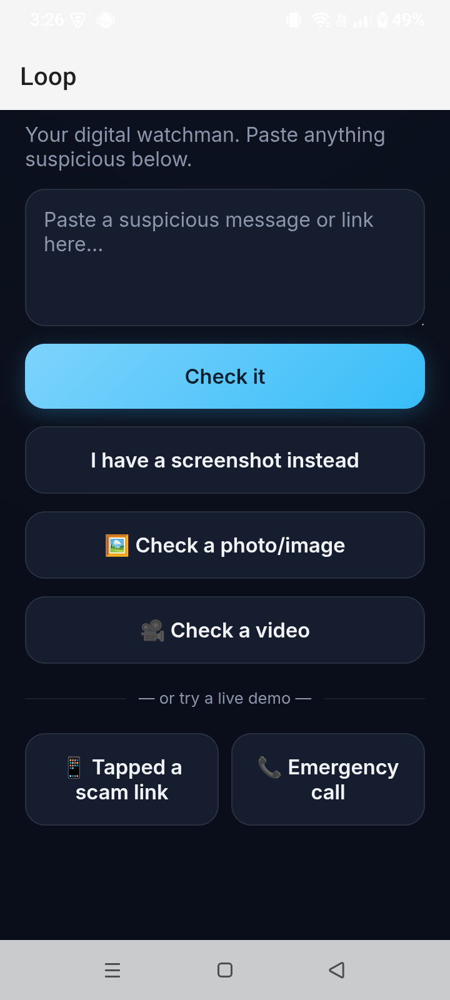
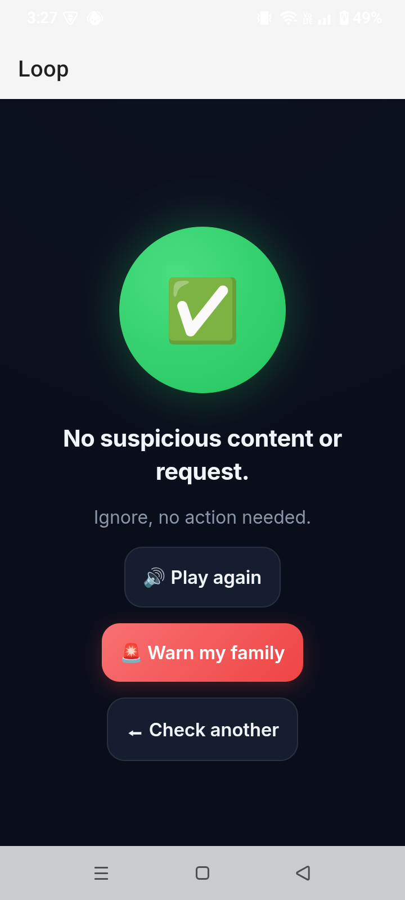
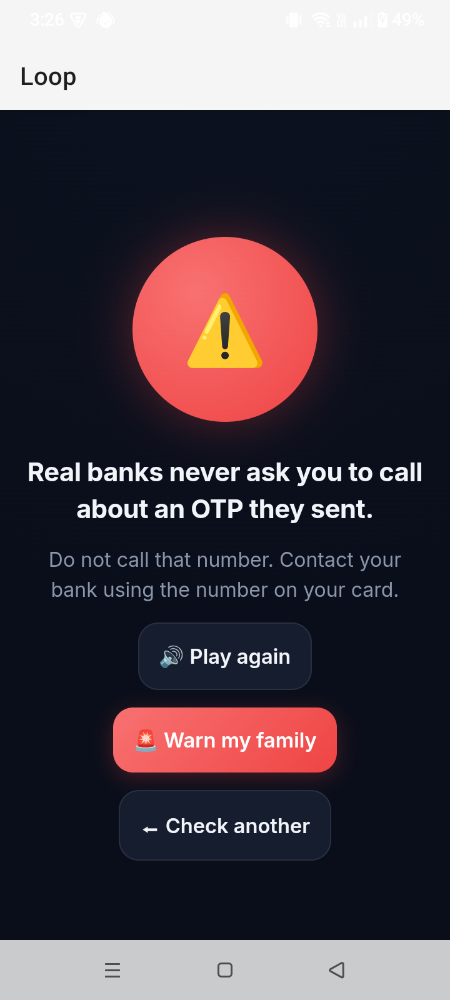
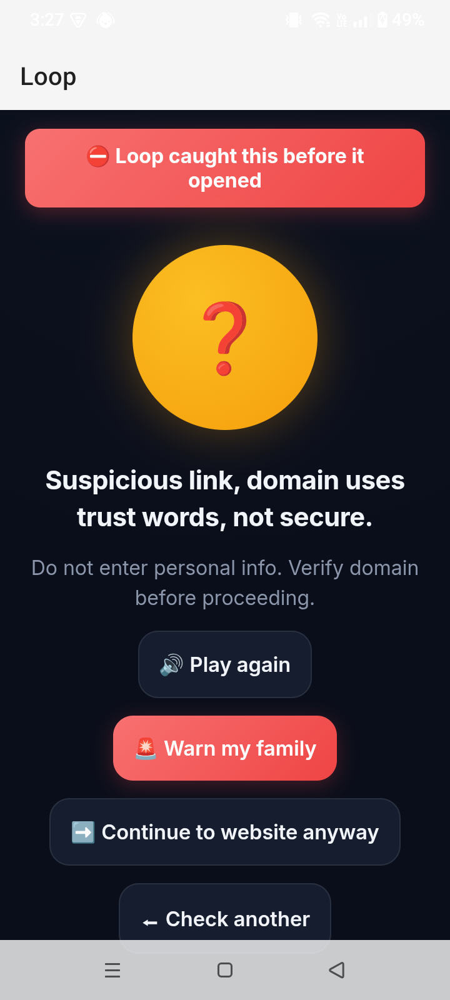
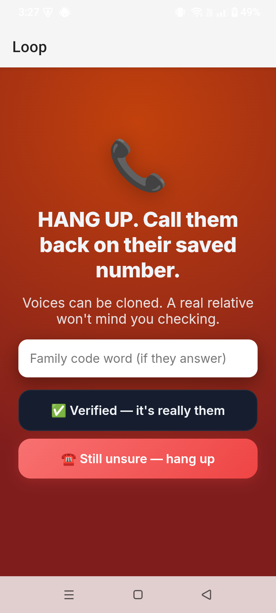

# Loop

**A proactive Android digital shield against scams and deepfakes — built for people who don't yet know to be suspicious.**

🏆 3rd Place — Social Nova Hackathon 2026, Habib University Karachi (Sep 12, 2026)

## Problem

The hackathon challenge ("The Digital Shield") asked: how can we help non-technical, low-literacy internet users identify, verify, and flag AI-generated deepfakes and digital scams before they get fooled? Existing tools are text-heavy, English-first, and reactive — they only help someone who already suspects something is wrong. The full challenge handout is in [`docs/problem-statement/`](docs/problem-statement).

## Our solution

Loop is a **proactive** shield, not a reactive scanner:

- **IDENTIFY** — paste or share a message, link, or screenshot and get a spoken verdict in your language: a red/yellow/green light plus one plain-language reason (Urdu + English).
- **VERIFY** — for deepfake voice/video "emergencies" there is no reliable detector, so Loop forces the one defence that beats even a perfect clone: hang up, call back on the real number, use a family code word.
- **FLAG** — after a red verdict, warn family/mohalla in one tap so the next person is protected.

Android is the core of the design, not an afterthought: Loop can register as the default handler for `http`/`https` links, so a tapped link is checked *before* it opens, and Android's share sheet gives a "share-to-Loop" flow with no onboarding needed.

Full product reasoning, trust principles, and stated limitations: [`docs/pitch/loop-brief.md`](docs/pitch/loop-brief.md) (original concept) and [`docs/pitch/PITCH_BRIEF.md`](docs/pitch/PITCH_BRIEF.md) (as actually built).

## How it works

```
Android app (WebView shell)          Node server               LLM checks
┌─────────────────────────┐         ┌───────────────┐         ┌────────────────┐
│ MainActivity  – launcher │         │ server.js     │         │ Groq (text)     │
│ CheckActivity – link/    │  HTTP   │  /api/check       │────▶│ Gemini (image/  │
│   share intake, WebView  │────────▶│  /api/check-image │     │   video)        │
│ BubbleService – floating │         │  /api/check-video │     └────────────────┘
│   shield overlay         │         └───────┬───────┘
└─────────────────────────┘                 │ serves
                                             ▼
                                     public/index.html (UI)
```

- `server.js` — plain Node `http` server (no framework), routes `/api/check*` and serves `public/`.
- `verdict.js`, `image-verdict.js`, `video-verdict.js` — build the LLM prompt/response for each input type; each fails safe to a cautious "yellow" verdict if the API call fails or a key is missing.
- `load-env.js` — minimal hand-rolled `.env` loader (no dependency).
- `public/index.html` — the web UI, loaded inside the Android app's WebView and also usable directly in a browser.
- `android/` — the Android shell: link-handler + share-target + floating bubble, all pointing at the Node server.

## Running it

```bash
npm start        # starts the server on http://localhost:3000
npm test         # runs the scenario checks in test_check.js
```

Requires a `.env` file in the project root (not committed) with:

```
GROQ_API_KEY=...
GEMINI_API_KEY=...
```

Without keys the server still runs and returns a generic cautious verdict instead of failing.

To run the Android shell: open `android/` in Android Studio, update `CheckActivity.SERVER_URL` to point at the machine running the Node server, and run on a device on the same network.

## Screenshots

| Home | Safe (green) | Scam (red) |
|---|---|---|
|  |  |  |
| Paste a message/link, or try a live demo | No suspicious content — nothing to do | Fake-OTP-helpline scam caught, with one plain reason |

| Proactive link interception | VERIFY (voice/video emergency) |
|---|---|
|  |  |
| A tapped scam link is caught *before* it opens | Forces the one defence that beats even a perfect clone: hang up, call back, family code word |

## Team & credits

Built solo by Arham for Social Nova Hackathon 2026 at Habib University Karachi.

## License

[MIT](LICENSE)
